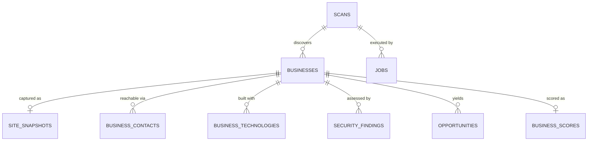

# LeadKhojo — Database Schema

| | |
|---|---|
| **Version** | 1.0 |
| **Date** | 2026-07-30 |
| **Engine** | PostgreSQL 16 |
| **Depends on** | [03-ARCHITECTURE.md](03-ARCHITECTURE.md) |

---

## 1. Conventions

| Rule | Decision |
|---|---|
| Primary keys | `UUID` (v7 where the library allows — time-ordered, good index locality) |
| Timestamps | `TIMESTAMPTZ`, always UTC |
| Enums | Postgres native `ENUM` for stable domains; `TEXT` + `CHECK` where values will churn |
| JSON | `JSONB` only, always with a documented shape |
| Nullability | `NOT NULL` unless null carries meaning |
| Deletes | Hard delete with `ON DELETE CASCADE`. There is no soft delete in v1 — a scan the user deletes should actually be gone. |
| Naming | See [Folder Structure §6](04-FOLDER-STRUCTURE.md) |

**No `users`, `organizations`, or `org_id` columns.** v1 is single-user. Adding tenancy later is one nullable column plus a backfill — see [SaaS Migration Plan §3](12-SAAS-MIGRATION-PLAN.md), which is written so this decision is cheap to reverse.

**Extensions:**

```sql
CREATE EXTENSION IF NOT EXISTS citext;    -- case-insensitive domains and emails
CREATE EXTENSION IF NOT EXISTS pgcrypto;  -- gen_random_uuid()
```

---

## 2. Entity relationships



Nine tables. Every one earns its place.

---

## 3. Core tables

### 3.1 `scans`

One user request. The root of everything.

```sql
CREATE TYPE scan_status AS ENUM
    ('pending','discovering','analyzing','completed','failed','cancelled');

CREATE TYPE discovery_provider AS ENUM
    ('csv_import','google_places','openstreetmap');

CREATE TABLE scans (
    id                  UUID PRIMARY KEY DEFAULT gen_random_uuid(),
    keyword             TEXT,
    location            TEXT,
    provider            discovery_provider NOT NULL,
    result_limit        INTEGER NOT NULL DEFAULT 25
                        CHECK (result_limit BETWEEN 1 AND 100),
    status              scan_status NOT NULL DEFAULT 'pending',

    -- progress counters, updated as businesses complete
    total_businesses    INTEGER NOT NULL DEFAULT 0,
    completed_count     INTEGER NOT NULL DEFAULT 0,
    failed_count        INTEGER NOT NULL DEFAULT 0,

    error_message       TEXT,
    started_at          TIMESTAMPTZ,
    completed_at        TIMESTAMPTZ,
    created_at          TIMESTAMPTZ NOT NULL DEFAULT now(),

    CONSTRAINT ck_scans__query_or_import
        CHECK (provider = 'csv_import' OR keyword IS NOT NULL)
);

CREATE INDEX ix_scans__status_created ON scans (status, created_at DESC);
```

`ck_scans__query_or_import` encodes a real rule: a CSV import needs no keyword, everything else does.

### 3.2 `businesses`

One discovered company within one scan.

```sql
CREATE TYPE business_status AS ENUM
    ('pending','crawling','analyzing','completed','failed','no_website','skipped');

CREATE TYPE crawl_failure AS ENUM
    ('dns_failure','connection_refused','tls_error','timeout',
     'http_4xx','http_5xx','robots_denied','parked_domain','render_failure');

CREATE TABLE businesses (
    id                  UUID PRIMARY KEY DEFAULT gen_random_uuid(),
    scan_id             UUID NOT NULL REFERENCES scans(id) ON DELETE CASCADE,

    name                TEXT NOT NULL,
    website_url         TEXT,
    domain              CITEXT,              -- canonical registrable domain
    final_url           TEXT,                -- after redirects

    -- from the discovery provider
    address             TEXT,
    city                TEXT,
    region              TEXT,
    country_code        CHAR(2),
    category            TEXT,
    source_phone        TEXT,
    source_provider     discovery_provider NOT NULL,
    source_external_id  TEXT,                -- e.g. Google place_id
    source_data         JSONB NOT NULL DEFAULT '{}',
    -- Discovery-provider caching terms (see §6). NULL = no expiry (CSV import).
    source_expires_at   TIMESTAMPTZ,

    status              business_status NOT NULL DEFAULT 'pending',
    failure_reason      crawl_failure,
    failure_detail      TEXT,

    crawled_at          TIMESTAMPTZ,
    analyzed_at         TIMESTAMPTZ,
    created_at          TIMESTAMPTZ NOT NULL DEFAULT now(),

    CONSTRAINT uq_businesses__scan_domain UNIQUE (scan_id, domain)
);

CREATE INDEX ix_businesses__scan_status ON businesses (scan_id, status);
CREATE INDEX ix_businesses__domain      ON businesses (domain);
CREATE INDEX ix_businesses__source_expiry
    ON businesses (source_expires_at) WHERE source_expires_at IS NOT NULL;
```

`uq_businesses__scan_domain` **is** the deduplication guarantee (FR-DISC-6). `domain` is nullable, and Postgres permits many NULLs in a unique index — so businesses with no website coexist without collision.

### 3.3 `site_snapshots`

The raw capture. Everything downstream is derived from this row.

```sql
CREATE TYPE snapshot_status AS ENUM ('complete','partial','failed');
CREATE TYPE render_mode AS ENUM ('http','playwright');

CREATE TABLE site_snapshots (
    id                  UUID PRIMARY KEY DEFAULT gen_random_uuid(),
    business_id         UUID NOT NULL UNIQUE
                        REFERENCES businesses(id) ON DELETE CASCADE,

    status              snapshot_status NOT NULL,
    render_mode         render_mode NOT NULL DEFAULT 'http',
    final_url           TEXT,
    http_status         SMALLINT,
    redirect_chain      JSONB NOT NULL DEFAULT '[]',

    -- The capture itself. Shape documented in §4.
    pages               JSONB NOT NULL DEFAULT '[]',
    tls                 JSONB,
    dns                 JSONB,
    cookies             JSONB NOT NULL DEFAULT '[]',
    robots              JSONB,
    timings             JSONB NOT NULL DEFAULT '{}',

    page_count          SMALLINT NOT NULL DEFAULT 0,
    total_bytes         INTEGER NOT NULL DEFAULT 0,
    duration_ms         INTEGER,
    captured_at         TIMESTAMPTZ NOT NULL DEFAULT now()
);

CREATE INDEX ix_site_snapshots__captured ON site_snapshots (captured_at);
```

**One snapshot per business, enforced by `UNIQUE`.** Re-analysis replaces it. This is deliberate: a business has one current truth, and comparing versions over time is a v4 monitoring feature with its own table.

**Why JSONB and not normalized tables.** Snapshot contents are read whole, by analyzers, in one shot — never queried field-by-field. Normalizing pages, headers, and DNS records into six tables would add joins, migrations, and code for zero benefit. This is the correct use of JSONB: an opaque document with a documented shape, consumed as a unit.

**Growth:** roughly 50–500 KB per site. At 100 scans × 50 businesses that is under 3 GB — fine in Postgres. The `SnapshotStore` interface exists so the move to object storage is a one-file change when it matters.

---

## 4. Snapshot JSONB shapes

Documented here because six modules read them. **These shapes are a contract.** Changing one is a breaking change requiring a fixture migration.

```jsonc
// pages[] — one entry per fetched page
[{
  "url": "https://acme.com/contact",
  "final_url": "https://acme.com/contact",
  "status": 200,
  "headers": { "content-type": "text/html; charset=utf-8", "server": "nginx/1.18.0" },
  "html": "<!doctype html>…",
  "text": "Contact us …",            // extracted visible text
  "content_hash": "sha256:9f2b…",
  "bytes": 48211,
  "response_time_ms": 412,
  "page_type": "contact"             // home | contact | about | privacy | legal | other
}]

// tls
{
  "protocol": "TLSv1.3",
  "cipher": "TLS_AES_256_GCM_SHA384",
  "issuer": "Let's Encrypt R3",
  "subject": "acme.com",
  "sans": ["acme.com", "www.acme.com"],
  "not_before": "2026-05-01T00:00:00Z",
  "not_after":  "2026-08-08T00:00:00Z",
  "is_self_signed": false,
  "chain_complete": true,
  "hostname_matches": true
}

// dns
{
  "a":     ["104.21.5.12"],
  "aaaa":  [],
  "mx":    ["10 mail.acme.com"],
  "ns":    ["ns1.cloudflare.com", "ns2.cloudflare.com"],
  "txt":   ["v=spf1 include:_spf.google.com ~all"],
  "cname": null,
  "dmarc": null,                      // null = NXDOMAIN (a finding, not an error)
  "dnssec": false,
  "resolved_ip": "104.21.5.12",
  "asn": 13335,
  "asn_org": "Cloudflare, Inc."
}

// cookies[]
[{ "name": "PHPSESSID", "secure": false, "http_only": true, "same_site": null, "source_url": "…" }]

// robots
{ "exists": true, "disallowed_paths": ["/admin"], "sitemaps": ["https://acme.com/sitemap.xml"], "blocked_us": false }

// timings
{ "dns_ms": 24, "connect_ms": 61, "ttfb_ms": 380, "total_ms": 1840 }
```

> **`dmarc: null` means NXDOMAIN, and NXDOMAIN is the finding.** Analyzers must distinguish "we looked and it wasn't there" from "we never looked." Where that distinction matters, the field is present with an explicit null rather than absent.

---

## 5. Derived tables

All five are written by the analysis pipeline and rebuilt wholesale on re-analysis.

### 5.1 `business_contacts`

```sql
CREATE TYPE contact_kind AS ENUM ('email','phone','address','social','form');

CREATE TYPE contact_category AS ENUM
    ('general','sales','support','careers','security','billing',
     'linkedin','facebook','twitter','instagram','youtube','other');

CREATE TABLE business_contacts (
    id                  UUID PRIMARY KEY DEFAULT gen_random_uuid(),
    business_id         UUID NOT NULL REFERENCES businesses(id) ON DELETE CASCADE,
    kind                contact_kind NOT NULL,
    category            contact_category NOT NULL DEFAULT 'general',
    value               TEXT NOT NULL,
    normalized_value    CITEXT NOT NULL,     -- lowercased email / E.164 phone
    source_url          TEXT NOT NULL,       -- REQUIRED: where we found it
    rank                SMALLINT NOT NULL DEFAULT 100,  -- lower = better contact
    created_at          TIMESTAMPTZ NOT NULL DEFAULT now(),

    CONSTRAINT uq_business_contacts__value
        UNIQUE (business_id, kind, normalized_value)
);

CREATE INDEX ix_business_contacts__business ON business_contacts (business_id, kind, rank);
```

**`source_url` is `NOT NULL`.** This is the schema enforcing FR-CONTACT-8 and, transitively, FR-CONTACT-9: you cannot insert a contact without saying where you found it, so you cannot insert a guessed one. The rule is structural, not a convention someone has to remember.

One table with a `kind` discriminator rather than four tables — emails, phones, addresses, and socials share every column and are always read together.

### 5.2 `business_technologies`

```sql
CREATE TYPE tech_confidence AS ENUM ('certain','likely','possible');

CREATE TABLE business_technologies (
    id                  UUID PRIMARY KEY DEFAULT gen_random_uuid(),
    business_id         UUID NOT NULL REFERENCES businesses(id) ON DELETE CASCADE,
    technology_id       TEXT NOT NULL,       -- 'wordpress' — matches the rule pack
    name                TEXT NOT NULL,
    category            TEXT NOT NULL,
    version             TEXT,
    confidence          tech_confidence NOT NULL,
    is_outdated         BOOLEAN,             -- NULL = unknown (no version detected)
    versions_behind     SMALLINT,
    evidence            JSONB NOT NULL DEFAULT '{}',
    created_at          TIMESTAMPTZ NOT NULL DEFAULT now(),

    CONSTRAINT uq_business_technologies UNIQUE (business_id, technology_id)
);

CREATE INDEX ix_business_technologies__tech ON business_technologies (technology_id);
CREATE INDEX ix_business_technologies__business_cat
    ON business_technologies (business_id, category);
```

**`is_outdated` is nullable and that is load-bearing.** `NULL` means "we detected the technology but not its version," which is different from "it is current." The Opportunity Engine's specificity gate (FR-OPP-6) reads exactly this: `NULL` produces no opportunity, because "your CMS might be old" is not a pitch.

### 5.3 `security_findings`

```sql
CREATE TYPE finding_status   AS ENUM ('pass','fail','warn','info','not_applicable');
CREATE TYPE finding_severity AS ENUM ('critical','high','medium','low','info');

CREATE TABLE security_findings (
    id                  UUID PRIMARY KEY DEFAULT gen_random_uuid(),
    business_id         UUID NOT NULL REFERENCES businesses(id) ON DELETE CASCADE,
    check_id            TEXT NOT NULL,       -- 'DNS-03'
    category            TEXT NOT NULL,       -- 'email_auth'
    status              finding_status NOT NULL,
    severity            finding_severity NOT NULL,
    title               TEXT NOT NULL,
    description         TEXT NOT NULL,
    evidence            JSONB NOT NULL,      -- REQUIRED
    remediation         TEXT,
    created_at          TIMESTAMPTZ NOT NULL DEFAULT now(),

    CONSTRAINT uq_security_findings UNIQUE (business_id, check_id)
);

CREATE INDEX ix_security_findings__business_sev
    ON security_findings (business_id, severity, status);
CREATE INDEX ix_security_findings__failing
    ON security_findings (business_id) WHERE status IN ('fail','warn');
```

`evidence JSONB NOT NULL` — a finding without evidence cannot be stored. Principle 7.4 of the [Vision](01-VISION.md), enforced by a column definition.

### 5.4 `opportunities`

The table the user actually cares about.

```sql
CREATE TYPE opportunity_urgency  AS ENUM ('critical','high','medium','low');
CREATE TYPE opportunity_category AS ENUM
    ('security','performance','maintenance','development','marketing','hosting','compliance');

CREATE TABLE opportunities (
    id                  UUID PRIMARY KEY DEFAULT gen_random_uuid(),
    business_id         UUID NOT NULL REFERENCES businesses(id) ON DELETE CASCADE,
    rule_id             TEXT NOT NULL,       -- 'ssl_renewal'
    title               TEXT NOT NULL,
    category            opportunity_category NOT NULL,
    urgency             opportunity_urgency NOT NULL,
    description         TEXT NOT NULL,       -- plain business language
    pitch_angle         TEXT NOT NULL,       -- how to open the conversation
    evidence            JSONB NOT NULL,      -- the findings that triggered it
    triggered_by        TEXT[] NOT NULL,     -- check_ids / technology_ids
    created_at          TIMESTAMPTZ NOT NULL DEFAULT now(),

    CONSTRAINT uq_opportunities UNIQUE (business_id, rule_id)
);

CREATE INDEX ix_opportunities__business_urgency
    ON opportunities (business_id, urgency);
CREATE INDEX ix_opportunities__category ON opportunities (category);
```

`triggered_by` makes the chain auditable end to end: opportunity → findings → snapshot → the exact bytes on the page.

### 5.5 `business_scores`

```sql
CREATE TABLE business_scores (
    business_id         UUID PRIMARY KEY REFERENCES businesses(id) ON DELETE CASCADE,

    lead_score          SMALLINT NOT NULL CHECK (lead_score        BETWEEN 0 AND 100),
    website_score       SMALLINT NOT NULL CHECK (website_score     BETWEEN 0 AND 100),
    security_score      SMALLINT NOT NULL CHECK (security_score    BETWEEN 0 AND 100),
    opportunity_score   SMALLINT NOT NULL CHECK (opportunity_score BETWEEN 0 AND 100),

    breakdowns          JSONB NOT NULL,      -- { "lead": {"contact": 32, …}, … }
    confidence          NUMERIC(3,2) NOT NULL DEFAULT 1.00
                        CHECK (confidence BETWEEN 0 AND 1),
    computed_at         TIMESTAMPTZ NOT NULL DEFAULT now()
);

CREATE INDEX ix_business_scores__opportunity ON business_scores (opportunity_score DESC);
CREATE INDEX ix_business_scores__lead        ON business_scores (lead_score DESC);
```

`breakdowns` is `NOT NULL` — FR-SCORE-2 says a score without a breakdown is not shippable, so the schema refuses to store one.

---

## 6. Jobs

```sql
CREATE TYPE job_status AS ENUM ('pending','running','completed','failed','cancelled');
CREATE TYPE job_type   AS ENUM ('discover','analyze_business','finalize_scan','purge_expired');

CREATE TABLE jobs (
    id                  UUID PRIMARY KEY DEFAULT gen_random_uuid(),
    scan_id             UUID REFERENCES scans(id) ON DELETE CASCADE,
    type                job_type NOT NULL,
    payload             JSONB NOT NULL DEFAULT '{}',

    status              job_status NOT NULL DEFAULT 'pending',
    priority            SMALLINT NOT NULL DEFAULT 100,   -- lower runs first
    attempts            SMALLINT NOT NULL DEFAULT 0,
    max_attempts        SMALLINT NOT NULL DEFAULT 3,

    run_after           TIMESTAMPTZ NOT NULL DEFAULT now(),
    locked_at           TIMESTAMPTZ,
    locked_by           TEXT,
    error               TEXT,

    created_at          TIMESTAMPTZ NOT NULL DEFAULT now(),
    completed_at        TIMESTAMPTZ
);

-- The one index that matters: the claim query's exact access path
CREATE INDEX ix_jobs__claimable ON jobs (priority, run_after)
    WHERE status = 'pending';

CREATE INDEX ix_jobs__scan ON jobs (scan_id, status);
```

**The claim query:**

```sql
UPDATE jobs SET status = 'running', locked_at = now(), locked_by = :worker_id,
                attempts = attempts + 1
WHERE id = (
    SELECT id FROM jobs
    WHERE status = 'pending' AND run_after <= now()
    ORDER BY priority, created_at
    FOR UPDATE SKIP LOCKED
    LIMIT 1
)
RETURNING *;
```

`FOR UPDATE SKIP LOCKED` is the entire concurrency design. Multiple workers — and later multiple processes — poll the same table and never double-claim. A stale `locked_at` (worker died mid-job) is reclaimed by a sweeper that resets rows locked longer than the job type's timeout.

### 6.1 Discovery data retention

`purge_expired` runs daily and enforces the Google Places caching terms discussed in [PRD §3.2](02-PRD.md):

```sql
-- Clear provider-sourced fields past their permitted cache window.
-- The external ID stays (permitted indefinitely); crawled data is untouched
-- because it came from the company's own website, not from the provider.
UPDATE businesses
SET address = NULL, source_phone = NULL, category = NULL,
    source_data = '{}', source_expires_at = NULL
WHERE source_expires_at IS NOT NULL AND source_expires_at < now();
```

This is a compliance obligation implemented as a scheduled job, not a policy someone has to remember.

---

## 7. Data integrity guarantees

What the schema itself enforces, and which requirement each satisfies.

| Invariant | Mechanism | Requirement |
|---|---|---|
| No duplicate business per scan | `uq_businesses__scan_domain` | FR-DISC-6 |
| A contact cannot exist without provenance | `source_url NOT NULL` | FR-CONTACT-8/9 |
| A finding cannot exist without evidence | `evidence JSONB NOT NULL` | FR-SEC-2 |
| An opportunity cannot exist without evidence | `evidence JSONB NOT NULL` | FR-OPP-2 |
| A score cannot exist without a breakdown | `breakdowns JSONB NOT NULL` | FR-SCORE-2 |
| Scores stay within 0–100 | `CHECK` constraints | FR-SCORE-1 |
| One snapshot per business | `UNIQUE (business_id)` | ADR-02 |
| No duplicate check per business | `uq_security_findings` | FR-SEC-3 |
| Deleting a scan deletes everything under it | `ON DELETE CASCADE` throughout | Vision §7.3 |
| A CSV-import scan needs no keyword | `ck_scans__query_or_import` | FR-DISC-4 |
| Expired provider data is purged | `purge_expired` job + partial index | NFR-SEC-8 |

---

## 8. Migration policy

Alembic, expand/contract, even in v1 — because the habit is cheaper to keep than to acquire.

| Change | Approach |
|---|---|
| Add a column | Nullable, or `NOT NULL` with a default |
| Drop a column | Release N stops reading it; release N+1 drops it |
| Rename a column | Add → dual-write → backfill → switch reads → drop |
| Add an index | `CREATE INDEX CONCURRENTLY`, outside a transaction |
| Add an enum value | `ALTER TYPE … ADD VALUE` (never remove one) |
| Backfill data | A resumable script in `scripts/`, **never inside a migration** |
| **Change a snapshot JSONB shape** | Bump `snapshot_schema_version`, migrate fixtures, support both shapes for one release |

That last row is the one that will bite. The snapshot shape is a contract between the crawler and six analyzers plus the entire test corpus. Treat a change to it with the same care as a public API change.

---

## 9. Expected scale (v1)

| Table | Rows per 50-business scan | 100 scans |
|---|---|---|
| `scans` | 1 | 100 |
| `businesses` | 50 | 5,000 |
| `site_snapshots` | ~45 | ~4,500 (**~1–2 GB — the dominant consumer**) |
| `business_contacts` | ~150 | 15,000 |
| `business_technologies` | ~400 | 40,000 |
| `security_findings` | ~1,400 (28 checks × 50) | 140,000 |
| `opportunities` | ~120 | 12,000 |
| `business_scores` | ~45 | 4,500 |
| `jobs` | ~52 | 5,200 |

Total well under 5 GB at 100 scans. A single Postgres instance handles this without tuning. Snapshots dominate, which is exactly why `SnapshotStore` is an interface and why `captured_at` is indexed — the first scaling move is aging snapshots out to object storage.
